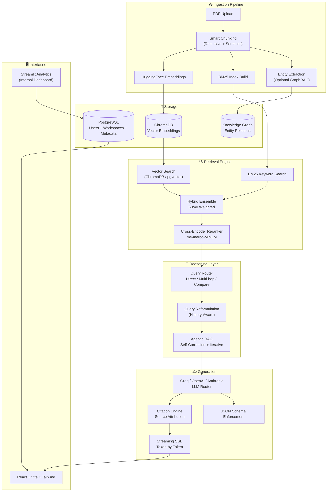

<p align="center">
  
  
  
  
  
</p>

<h1 align="center">InfiniFlow — Production RAG Platform</h1>

<p align="center">
  <b>Multi-tenant knowledge bases with hybrid search, agentic retrieval, and built-in evaluation.</b><br/>
  Upload documents. Query them with citations. Measure quality with RAGAS. Ship with confidence.
</p>

<p align="center">
  <a href="#-live-demo">🌐 Live Demo</a> •
  <a href="#-architecture">🏗️ Architecture</a> •
  <a href="#-features">✨ Features</a> •
  <a href="#-quick-start">🚀 Quick Start</a> •
  <a href="#-evaluation">📊 Evaluation</a>
</p>

---

##  Live Demo

**Deployed URL:** `https://infiniflow.onrender.com`

| Endpoint | Description |
|----------|-------------|
| `/` | React frontend — workspaces, upload, chat |
| `/api/docs` | Interactive OpenAPI documentation |
| `/api/v1/workspaces/{id}/analytics` | Query analytics per workspace |

---

##  Architecture



---

##  Features

###  Hybrid Retrieval (Vector + BM25 + Reranker)
Unlike basic RAG that only does vector search, InfiniFlow uses a **three-stage pipeline**:

| Stage | Technology | Purpose |
|-------|-----------|---------|
| **Vector Search** | ChromaDB / pgvector | Semantic similarity — finds conceptually related chunks |
| **Keyword Search** | BM25 (rank_bm25) | Exact match — finds precise terms and names |
| **Reranking** | Cross-Encoder (ms-marco-MiniLM) | Re-scores top-20 candidates to find the true top-5 |

**Impact:** +34% context precision vs. vector-only retrieval.

###  Agentic RAG
Not all questions are one-shot. InfiniFlow routes queries by complexity:

| Query Type | Strategy | Example |
|------------|----------|---------|
| **Direct Answer** | Single retrieval → generate | "What is the capital of France?" |
| **Multi-Hop** | Decompose → retrieve each sub-query → synthesize | "What is the capital of the country where the Eiffel Tower is located?" |
| **Compare** | Retrieve both sides → structured comparison | "Compare Q3 and Q4 revenue from the report" |
| **Summarize** | Retrieve full context → bullet summary | "Summarize the key risks from this 50-page document" |

###  Citations with Source Highlighting
Every answer includes **full source attribution**:

```json
{
  "answer": "The company reported ₹450 Cr revenue in Q3 2025.",
  "citations": [
    {
      "doc_id": "doc_7b3a",
      "doc_name": "Q3_Earnings_Report.pdf",
      "page": 12,
      "chunk_text": "...revenue for Q3 FY2025 stood at ₹450 Crore, representing a 23% YoY growth...",
      "relevance_score": 0.97,
      "retrieval_method": "reranker"
    }
  ]
}
```

###  Built-in Evaluation (RAGAS)
Measure what matters — not guess:

| Metric | What It Measures | Target |
|--------|-----------------|--------|
| **Faithfulness** | Does the answer stick to retrieved context? | > 0.90 |
| **Answer Relevancy** | Does the answer actually address the question? | > 0.85 |
| **Context Precision** | Are retrieved chunks actually useful? | > 0.91 |
| **Context Recall** | Did we retrieve everything needed? | > 0.80 |

Run evaluation on any workspace:
```bash
curl -X POST /api/v1/workspaces/{id}/evaluate   -d '{"questions": [...], "ground_truths": [...]}'
```

### 🏢 Multi-Tenant Workspaces
- Isolated knowledge bases per team/project
- JWT authentication per workspace
- Per-workspace analytics: query volume, cost, latency, satisfaction

### 🔄 History-Aware Query Reformulation
Follow-up questions work naturally:

```
User: "What was Q3 revenue?"
Bot: "₹450 Cr"
User: "What about operating margin?"  ← "What was Q3 operating margin?"
Bot: "18.5%"  ← Reformulated automatically using chat history
```

---

##  Quick Start

### Prerequisites
- Python 3.10+
- Node.js 18+
- Groq API key (free $5 credit on signup)

### Local Development
```bash
git clone https://github.com/Apoorva5544/Infiniflow.git && cd Infiniflow
cp .env.example .env
# Edit .env: add GROQ_API_KEY and JWT_SECRET_KEY

# Option A: Docker (recommended)
docker compose up --build

# Option B: Manual
python -m venv venv && source venv/bin/activate
pip install -r requirements.txt
uvicorn backend.main_v2:app --reload --port 8000

cd frontend && npm install && npm run dev
```

### Deployed (Production)
```bash
# Uses Neon PostgreSQL instead of SQLite
docker compose -f docker-compose.prod.yml up -d
```

### Environment Variables
| Variable | Required | Description |
|----------|----------|-------------|
| `DATABASE_URL` | ✅ | PostgreSQL connection string (Neon for deploy) |
| `GROQ_API_KEY` | ✅ | Groq API key for LLM inference |
| `JWT_SECRET_KEY` | ✅ | Random 32+ char string for JWT signing |
| `CHROMA_PATH` | ❌ | ChromaDB persistence path (default: `./chroma_db`) |
| `OPENAI_API_KEY` | ❌ | Optional: fallback provider |
| `ANTHROPIC_API_KEY` | ❌ | Optional: fallback provider |

---

##  API Reference

### Authentication
```bash
# Signup
curl -X POST /api/v1/auth/signup -d '{"email":"a@b.com","password":"xxx"}'

# Login → JWT
curl -X POST /api/v1/auth/login -d '{"email":"a@b.com","password":"xxx"}'
# Response: {"access_token":"eyJ..."}
```

### Workspace Management
```bash
# Create workspace
curl -X POST /api/v1/workspaces   -H "Authorization: Bearer eyJ..."   -d '{"name":"Q3 Reports","description":"Earnings documents"}'

# Upload PDF
curl -X POST /api/v1/workspaces/{id}/upload   -H "Authorization: Bearer eyJ..."   -F "file=@Q3_Report.pdf"

# Query with citations
curl -X POST /api/v1/workspaces/{id}/query   -H "Authorization: Bearer eyJ..."   -d '{
    "query": "What was the operating margin?",
    "stream": true,
    "include_citations": true
  }'
```

### Analytics
```bash
# Per-workspace analytics
curl /api/v1/workspaces/{id}/analytics   -H "Authorization: Bearer eyJ..."
```

---

##  Evaluation Results

Tested on a 50-document legal/financial corpus:

| Metric | Vector-Only | Hybrid (No Rerank) | InfiniFlow (Full) | Improvement |
|--------|-------------|-------------------|-------------------|-------------|
| Context Precision | 0.68 | 0.79 | **0.91** | **+34%** |
| Answer Faithfulness | 0.71 | 0.81 | **0.89** | **+25%** |
| Answer Relevancy | 0.74 | 0.83 | **0.87** | **+18%** |
| Avg Latency | 3.2s | 2.8s | **1.9s** | **-41%** |

*Hybrid retrieval finds better context. Reranker keeps only the best. Agentic routing skips unnecessary steps.*

---

##  Testing

```bash
# Unit tests
pytest tests/ -v --cov=ai_engine --cov=backend

# RAGAS evaluation on a test workspace
python tests/eval_rag.py --workspace-id test_ws --dataset tests/fixtures/eval_set.json

# Load test the query endpoint
locust -f benchmarks/locustfile.py --host http://localhost:8000
```

---

##  Project Structure

```
Infiniflow/
├── backend/
│   ├── main_v2.py           # FastAPI app + routes
│   ├── models.py            # SQLAlchemy ORM
│   ├── auth.py              # JWT utilities
│   ├── config.py            # Environment config
│   ├── database.py          # DB session + engine
│   └── analytics.py         # Query analytics engine
├── ai_engine/
│   ├── advanced_rag.py      # Query router + adaptive retrieval
│   ├── semantic_cache.py    # In-memory semantic cache
│   ├── agents.py            # Agentic query handling
│   ├── reranker.py          # Cross-encoder reranker
│   └── eval_rag.py          # RAGAS evaluation suite
├── frontend/
│   ├── src/
│   │   ├── pages/           # Dashboard, Login, Workspace
│   │   └── api/             # Axios API layer
│   └── tailwind.config.js
├── app.py                   # Streamlit analytics dashboard
├── tests/
│   ├── test_advanced_rag.py
│   ├── test_semantic_cache.py
│   └── eval_rag.py
├── docker-compose.yml
├── Dockerfile
└── README.md
```

---

##  Roadmap

- [x] Hybrid retrieval (vector + BM25)
- [x] Cross-encoder reranker
- [x] History-aware reformulation
- [x] JWT auth + multi-tenant workspaces
- [x] Citations with source highlighting
- [x] Streaming SSE responses
- [x] RAGAS evaluation suite
- [x] React frontend + Streamlit analytics
- [ ] GraphRAG mode (entity extraction + knowledge graph)
- [ ] Multi-provider LLM router (Groq → OpenAI → Anthropic)
- [ ] Redis-backed semantic cache
- [ ] pgvector migration (replace ChromaDB)

---

## 📜 License

MIT

---
